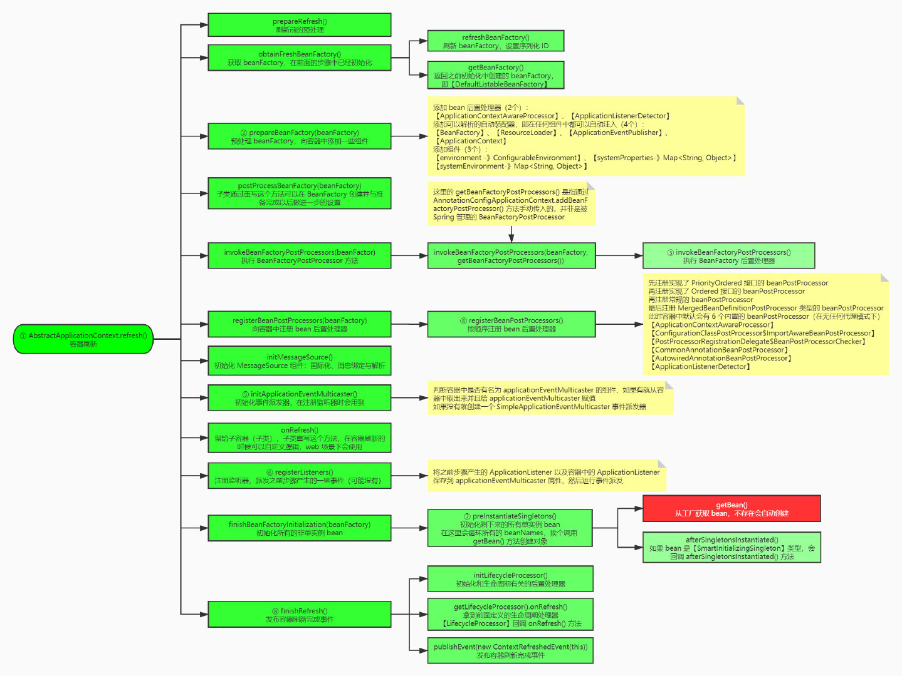

## ClassPathXmlApplicationContext源码解析
> 参考书籍 《Spring源码深度解析(第2版)》
---
- 构造方法中 setConfigLocations ,主要是配置路径，重新解析路径
- **refresh()** 构建 ApplicationContext主要方法 (AbstractApplicationContext类中)
- ** refresh()**方法下的主要调用链
  > 主要流程 
  > 图片来源 [https://blog.csdn.net/qq_35190492/article/details/110383213]
  - prepareRefresh 准备刷新的上下文环境
    - initPropertySources 方法，空方法，用户自行实现
    - getEnvironment().validateRequiredProperties方法，验证属性文件是否在环境中
  - obtainFreshBeanFactory 初始化BeanFactory,并进行XML文件读取
    > ApplicationContext是对BeanFactory功能上的扩展。通过该方法，ApplicationContext拥有了BeanFactory的全部功能
    > 
    > 该方法将具体的调用方法交给AbstractRefreshableApplicationContext类的refreshBeanFactory
    ``` java
    @Override
	protected final void refreshBeanFactory() throws BeansException {
            if (hasBeanFactory()) {
                destroyBeans();
                closeBeanFactory();
            }
            try {
            // 创建DefaultListableBeanFactory
                DefaultListableBeanFactory beanFactory = createBeanFactory();
                //执行序列化ID
                beanFactory.setSerializationId(getId());
                // 定制BeanFactory，该方法中还涉及是否允许bean覆盖、是否允许循环依赖，还设置了QualifierAnnotationAutowireCandidateResolver,用于@Qualifier和@Autowired
                customizeBeanFactory(beanFactory);
                // 加载BeanDefinition.主要通过XmlBeanDefinitionReader读取xml，进行BeanDefinition的加载
                loadBeanDefinitions(beanFactory);
                this.beanFactory = beanFactory;
            }
            catch (IOException ex) {
                throw new ApplicationContextException("I/O error parsing bean definition source for " + getDisplayName(), ex);
            }
	}
    ```
  - prepareBeanFactory 对BeanFactory进行填充
    > 对ApplicationContext的功能进行扩展
    - setBeanExpressionResolver 设置语言、表达式处理器
    - addBeanPostProcessor 添加BeanPostProcessor
    - ignoreDependencyInterface 设置几个忽略自动装配的接口，包括 ResourceLoaderAware,ApplicationEventPublisherAware,ApplicationContextAware,EnvironmentAware等
    - registerResolvableDependency 设置几个自动装配的特殊规则
    - beanFactory.addBeanPostProcessor(new LoadTimeWeaverAwareProcessor(beanFactory)) 设置对AspectJ的支持
    - 将相关环境变量及属性注册，以单例模式
  - postProcessBeanFactory 子类覆盖方法做额外的处理
  - invokeBeanFactoryPostProcess 激活各种BeanFactory处理器 (未仔细看详细处理)
  - registerBeanPostProcessors 注册拦截Bean创建的Bean处理器，只是注册，调用在getBean时
  - initMessageSource 为上下文初始化Message源，国际化处理
  - initApplicationEventMulticaster 初始化应用消息广播器
  - onRefresh 留给子类初始化其他的bean
  - registerListeners 在所有的bean中查找Listerner bean,注册到消息广播中
  - finishBeanFactoryInitialization 初始化剩下的单实例(非lazy)
    > ConversionService的配置、配置冻结、非延迟加载的bean的初始化工作
    ``` java
    protected void finishBeanFactoryInitialization(ConfigurableListableBeanFactory beanFactory) {
		// 初始化ConversionService ,用于对转换器(实现了Converter的类)的初始化
		if (beanFactory.containsBean(CONVERSION_SERVICE_BEAN_NAME) &&
				beanFactory.isTypeMatch(CONVERSION_SERVICE_BEAN_NAME, ConversionService.class)) {
			beanFactory.setConversionService(
					beanFactory.getBean(CONVERSION_SERVICE_BEAN_NAME, ConversionService.class));
		}
		// Register a default embedded value resolver if no bean post-processor
		// (such as a PropertyPlaceholderConfigurer bean) registered any before:
		// at this point, primarily for resolution in annotation attribute values.
		if (!beanFactory.hasEmbeddedValueResolver()) {
			beanFactory.addEmbeddedValueResolver(strVal -> getEnvironment().resolvePlaceholders(strVal));
		}
		// Initialize LoadTimeWeaverAware beans early to allow for registering their transformers early.
		String[] weaverAwareNames = beanFactory.getBeanNamesForType(LoadTimeWeaverAware.class, false, false);
		for (String weaverAwareName : weaverAwareNames) {
			getBean(weaverAwareName);
		}
		// Stop using the temporary ClassLoader for type matching.
		beanFactory.setTempClassLoader(null);
		// 冻结所有的bean定义，说明注册的bean定义将不被修改或任何进一步处理
		beanFactory.freezeConfiguration();
		// 初始化非延迟加载的bean,默认在启动时将所有单例bean提前实例化(调用类 DefaultListableBeanFactory,最终还是调用getBean->doGetBean->getSingleton->createBean->doCreateBean->populateBean->initialiBean等一套流程).
		beanFactory.preInstantiateSingletons();
	}
    ```
  - finishRefresh 完成刷新过程，通知生命周期处理器刷新，同时发出ContextRefreshEvent通知别人
  - 抛出异常时，调用destroyBeans方法和cancelRefresh方法

[]: https://blog.csdn.net/qq_35190492/article/details/110383213