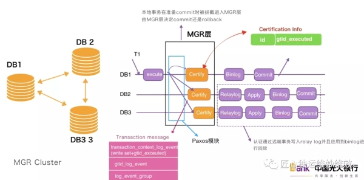

同步机制:
    1.主从复制
    2.半同步复制
    3.MGR 组复制 (https://database.51cto.com/art/202004/615706.htm)
        在主库提交一个事务时，会将事务修改记录相关的信息和事务产生的binlog事件打包成一个写集(write set) ,并至少通过N/2 + 1 个节点投票通过才能执行
        主要的操作就是在多台机器的 certify 过程中，该过程会对事务进行冲突检测的验证，验证没有冲突，则事务可以执行; 验证有冲突，则事务不可以执行
当 DB1 上有事务 T1 要执行时，T1 对 DB1 是来说本地事务，对于 DB2、DB3 来说是远端事务;DB1 上在事务 T1 在被执行后，会把执行事务 T1 信息广播给集群各个节点，包括 DB1 本身，通过 Paxos 模块广播给 MGR 集群各个节点，半数以上的节点同意并且达成共识，之后共识信息进入各个节点的冲突检测 certify 模块，各个节点各自进行冲突检测验证，最终保证事务在集群中最终一致性。
        在certify冲突检测之后，本地事务T1 在DB1直接提交，否则回滚。远端事务T1 在DB2 和DB3 分别先更新到relay log，然后应用到binlog

        transaction message (广播信息)
            write set(写集合) 事务更新行相关信息的hash值 Hash(库名+表名+主键)
            gtid_executed 已经执行过的事务gtid集合，事务快照版本
        *   write set 和gtid_executed 打包成成为 事务上下文信息 transaction_context_log_event
        *   gtid_log_event 已经执行过的事务gtid集合
        *   log_event_group 事务日志信息，后续要更新到relay log
        将带有* 号的内容打包成为 transaction message 广播到其他节点
        
        certifition info
        certifition info保存了通过冲突检测的事务的write set 和gtid_executed
        其相当于一个 map ，key时string结构，保存write set中提取的主键值; value 是 set集合，保存 gtid_executed 事务快照版本
        若 transaction UUID_MGR ">="certification info UUID_MGR，则冲突检测通过。 (该结论相当于 传过来的事务的uuid要大于节点验证信息中的uuid，已经验证过的uuid即是已经写入库中的uuid)

        冲突检测遵循下面三个原则:
            多个事务修改同一个id对应的数值，需要按照先后顺序进行冲突检测
            多个事务同时对不同的id进行修改，各自进行修改即可
            不同的事务对同一个id修改，需要按照先后顺序进行冲突检测
