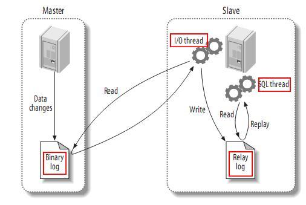

----

### mysql复制原理

#### mysql复制类型
    1.基于语句的复制 ：主库把sql语句写入到bin log中，完成复制 
        日志格式为 STATEMENT
        STATEMENT模式:(SBR)
        每一条会修改数据的sql语句会记录到binlog中。优点是并不需要记录每一条sql语句和每一行的数据变化，减少了binlog日志量，节约IO，提高性能。缺点是在某些情况下会导致master-slave中的数据不一致(如sleep()函数， last_insert_id()，以及user-defined functions(udf)等会出现问题)
    2.基于行数据的复制：主库把每一行数据变化的信息作为事件，写入到bin log，完成复制
        日志格式为ROW
        ROW模式(RBR)
        不记录每条sql语句的上下文信息，仅需记录哪条数据被修改了，修改成什么样了。而且不会出现某些特定情况下的存储过程、或function、或trigger的调用和触发无法被正确复制的问题。缺点是会产生大量的日志，尤其是alter table的时候会让日志暴涨。
    3.混合复制：上面两个结合体，默认用语句复制，出问题时候自动切换成行数据复制
        日志格式MIXED
        MIXED模式(MBR)
        以上两种模式的混合使用，一般的复制使用STATEMENT模式保存binlog，对于STATEMENT模式无法复制的操作使用ROW模式保存binlog，MySQL会根据执行的SQL语句选择日志保存方式。
---
#### 主从复制工作原理

    1.master数据库只要发生变化，立马记录到binary log日志文件种
    2.slave数据库启动一个I/O thread 连接master数据库，请求master变化的二进制日志
    3.slave I/O 获取到的二进制日志，保存到自己的relay log日志文件中
    4.slave 有一个 SQL thread定时检查relay log是否变化，变化就更新数据

