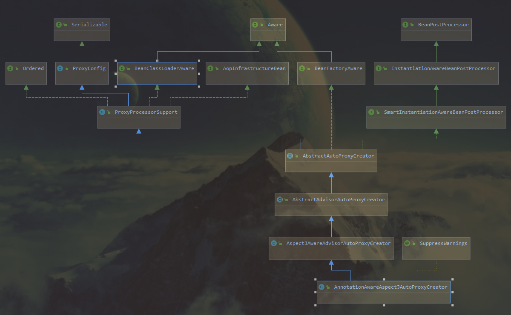

## Spring AOP源码初步跟踪
---

> 参考书籍 《Spring源码深度解析(第2版)》
> 
> 参考连接 <https://juejin.cn/post/6844903645700423687#heading-2>

---

- 解析入口
  AopNamespaceHandler类中，init方法存在 aspectj-autoproxy ，表示一旦遇到该注解，即创建 AspectJAutoProxyBeanDefinitionParser实例
  
  ``` java
	@Override
	public void init() {
		registerBeanDefinitionParser("config", new ConfigBeanDefinitionParser());
		registerBeanDefinitionParser("aspectj-autoproxy", new AspectJAutoProxyBeanDefinitionParser());
		registerBeanDefinitionDecorator("scoped-proxy", new ScopedProxyBeanDefinitionDecorator());
		registerBeanDefinitionParser("spring-configured", new SpringConfiguredBeanDefinitionParser());
  }
  ```
  
- AspectJAutoProxyBeanDefinitionParser#parse方法
  所有的解析器，都是对BeanDefinitionParser接口的统一实现，入口都是从parse函数开始
  
  ``` java
	@Override
	@Nullable
public BeanDefinition parse(Element element, ParserContext parserContext) {
// 注册AnnotationAwareAspectJAutoProxyCreator
AopNamespaceUtils.registerAspectJAnnotationAutoProxyCreatorIfNecessary(parserContext, element);
	//对于注解中子类的处理
		extendBeanDefinition(element, parserContext);
		return null;
  }
  ```
- AopNamespaceUtils#registerAspectJAnnotationAutoProxyCreatorIfNecessary
  该方法的主要作用就是注册AnnotationAutoProxy
  
  ``` java
	public static void registerAspectJAnnotationAutoProxyCreatorIfNecessary(
			ParserContext parserContext, Element sourceElement) {
			//注册或升级AutoProxyCreator定义的beanName为internalAutoProxyCreator的BeanDifinition
		BeanDefinition beanDefinition = AopConfigUtils.registerAspectJAnnotationAutoProxyCreatorIfNecessary(
				parserContext.getRegistry(), parserContext.extractSource(sourceElement));
				//对于proxy-target-class以及expose-proxy属性的处理
		useClassProxyingIfNecessary(parserContext.getRegistry(), sourceElement);
		registerComponentIfNecessary(beanDefinition, parserContext);
  }
  ```
  
  -  registerAspectJAnnotationAutoProxyCreatorIfNecessary方法
    对于AOP的实现，基本都是靠AnnotationAwareAspectAutoProxyCreator完成，可以根据@Point注解定义的切点来自动代理相匹配的bean。该方法就是spring自动注册AnnotationAwareAspectAutoProxyCreator类。
    该方法中，又接着调用registerOrEscalateApcAsRequired方法，不仅实现了自动注册功能，还涉及一个优先级的问题:如果已经存在了自动代理创建器，而且存在的自动代理创建器与现在的不一致，则需要根据优先级来判断到底使用哪个
  - useClassProxyingIfNecessary方法
    该方法实现了对proxy-target-class属性以及expose-proxy属性的处理。
    
	  ``` java
		private static void useClassProxyingIfNecessary(BeanDefinitionRegistry registry, @Nullable Element sourceElement) {
		if (sourceElement != null) {
		boolean proxyTargetClass = Boolean.parseBoolean(sourceElement.getAttribute(PROXY_TARGET_CLASS_ATTRIBUTE));
		if (proxyTargetClass) {
		// 对于proxy-target-class属性的处理			AopConfigUtils.forceAutoProxyCreatorToUseClassProxying(registry);
			}
			boolean exposeProxy = Boolean.parseBoolean(sourceElement.getAttribute(EXPOSE_PROXY_ATTRIBUTE));
			if (exposeProxy) {
			//对expose-proxy属性的处理
			AopConfigUtils.forceAutoProxyCreatorToExposeProxy(registry);
			}
  }
    }
    ```
    强制使用的过程其实也是一个属性设置的过程。
    proxy-target-class:默认为false。springaop提供了JDK动态代理或CGLIB来为目标对象创建代理(建议使用JDK动态代理)。强制使用CGLIB的话，需要将proxy-target-class设置为ture。**JDK动态代理**的代理对象必须是某个接口的实现，通过运行期间创建接口的实现类完成对目标对象的代理。**CGLIB代理**在运行期间生成的代理对象是针对目标类扩展的子类。
    expose-proxy:有时候目标对象内部的自我调用将无法实现切面的增强(常出现在事务的调用中)，可以将expose-proxy设置为true，使用((<T>)AopContext.currentProxy()).methods()方法调用
- AnnotationAwareAspectJAutoProxyCreator#在实例化之前调用postProcessAfterInitialization方法分析

  > AnnotationAwareAspectJAutoProxyCreator相关类图 
  > 
  > 
  该类最上层的接口为BeanPostProcessor接口，实现该接口之后，Spring加载这个Bean时，在实例化之前调用postProcessAfterInitialization方法，主要分析该方法(该方法在父类AbstractAutoProxyCreator方法中实现)
  - AbstractAutoProxyCreator#postProcessAfterInitialization方法
    - AbstractAutoProxyCreator#getCacheKey方法：根据给定的bean的class和name，构建一个key
    - **AbstractAutoProxyCreator#wrapIfNecessary方法**：如果合适被代理，则封装指定bean
  - AbstractAutoProxyCreator#wrapIfNecessary方法:
    主要逻辑如下：
    1. 该bean是否已经处理过
    2. 该bean是否需要增强
    3. 指定的bean是否是一个基础设施类(Point、Advisor类等，基础设施类不应代理)，或配置了指定bean不需要自动代理
    4. **getAdviceAndAdvisorsForBean** 该方法表示如果存在增强则创建代理
    5. **createProxy** 该方法表示创建代理
  - AbstractAutoProxyCreator#getAdviceAndAdvisorsForBean 方法
    该方法调用内部的findEligibleAdvisors方法，内部又调用了AnnotationAwareAspectJAutoProxyCreator#findCandidateAdvisors方法和AbstractAutoProxyCreator#findAdvisorsThadCanApply方法。主要的作用就是获取所有的增强以及寻找所有增强中适用于bean的增强并应用。
    - AnnotationAwareAspectJAutoProxyCreator#findCandidateAdvisors
        该方法用于获取被注解标注的增强的方法，首先获取了父类方法中的AOP声明，接着调用aspectJAdvisorsBuilder.buildAspectJAdvisors方法实现增强方法的获取。其主要流程为:
        1. 获取所有beanName，这一步骤中所有在beanFactory中注册的bean都会被提取出来
        2. 便利所有beanName，并找出声明AspectJ注解的类，进行进一步的处理
        3. 对标记为AspectJ注解的类进行增强器的提取
        4. 将提取结果加入缓存
        该方法中主要的就是对Advisor的提取，通过获取切点的信息，生成对应的增强器。获取切点信息的时候，会根据对应的方法上的注解 (@Before,@After)返回对应的切点的实体。之后，根据不同的注解，调用不同的增强器。如 AtBefore，调用AspectJMethodBeforeAdvice;AtAfter,调用对应的AspectJAfterAdvice等方法，经过增强后，就返回了所有增强的实体
    - AbstractAdvisorAutoProxyCreator#findAdvisorsThatCanApply方法
        完成了所有增强器的解析后，但不一定所有的增强器都适用，需要挑选出合适的增强器，也就是满足配置的通配符的增强器。
  - AbstractAutoProxyCreator#createProxy 方法
    对于代理类的创建及处理，Spring委托给了ProxyFactory处理，再此函数中，主要是对ProxyFactory的初始化操作，进而对真正的创建代理做准备。主要包括:

    - 获取当前类的属性
    - 添加代理接口
    - 封装Advisor并加入到ProxyFactory中

      该步骤先通过buildAdvisors方法包装返回Advisor[]数组，再通过proxyFactoryaddAdvisor方法加入增强器。buildAdvisors方法中，会将相关的拦截器、增强器、增强方法进行封装，同一封装成Advisor进行返回。
    - 设置要代理的类
    - customizeProxyFactory方法，子类可以在此函数中进行对ProxyFactory进一步封装
    - 进行代理获取操作
  - proxyFactory.getProxy(getProxyClassLoader())方法
    创建代理的方法又继续交给createAopProxy().getProxy(classLoader)方法
    
    - createAopProxy()返回AopProxy的实现类。
    	AopProxy接口拥有JdkDynamicAopProxy(使用JDK动态代理)和CglibProxyFactory(cglib代理的方式)。创建AopProxy方法中会根据条件返回具体的实体类。
    	
  	``` java
  @Override
  public AopProxy createAopProxy(AdvisedSupport config) throws AopConfigException {
  // optimize用来控CGLIB创建的代理是否使用激进的优化策略，不推荐设置，仅用于CGLIB
  //isProxyTargetClass=true，目标类本身被代理，而不是接口，使用CGLIB
  	//hasNoUserSuppliedProxyInterfaces是否存在代理接口，不存在，返回true
  	// 该三个条件都为true，则有可能使用CGLIB代理
  		if (config.isOptimize() || config.isProxyTargetClass() || hasNoUserSuppliedProxyInterfaces(config)) {
  		Class<?> targetClass = config.getTargetClass();
  		if (targetClass == null) {
  			throw new AopConfigException("TargetSource cannot determine target class: " +
  					"Either an interface or a target is required for proxy creation.");
  		}
  		// 如果目标类是个接口，那么也直接使用jdk动态代理
  		if (targetClass.isInterface() || Proxy.isProxyClass(targetClass)) {
  			return new JdkDynamicAopProxy(config);
  		}
  	return new ObjenesisCglibAopProxy(config);
  	}
  		else {
  return new JdkDynamicAopProxy(config);
    }
    	}
    	```
  - getProxy方法
    该方法根据返回来的AopProxy，调用对应的Proxy.newProxyInstance方法，返回对应的代理类。该方法需要三个参数ClassLoader，interfaces目标类的接口，InvocationHandler(每个AopProxy就是一个handler,通常传this)
    - JdkDynamicAopProxy类的具体描述可先查看以下链接内容
     <https://juejin.cn/post/6844903645700423687#heading-2>
     
     Jdk代理的主要流程或步骤:
     
     1. 处理equals方法
     2. 处理hashcode方法
     3. 调用isAssignableFrom方法
     4. AopContext.setCurrentProxy方法。有时候目标对象内部的自我调用无法实施切面中的增强，则需要通过此属性暴露代理，放入到AopContext的ThreadLocal中
     5. 获取当前方法的拦截器链
     6. 如果没有发现任何拦截器链，那么直接调用切点方法；否则，将拦截器封装在ReflectiveMethodInvocation中，以便于使用其proceed进行链接表用拦截器
     7. 执行拦截器链
     8. 返回结果