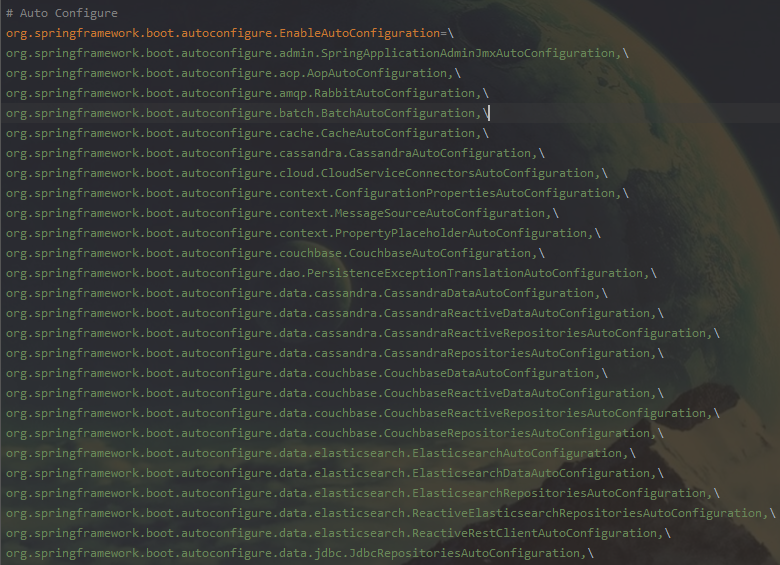

## Spring 自动配置原理 跟踪
---
> 参考链接 https://zhuanlan.zhihu.com/p/136469945
> 		         https://juejin.cn/post/6844903812788912141

---

- ### 主入口: @SpringBootApplication
  SpringBootApplication注解作用在程序的Application类上，有以下两个作用
  - 说明这个类是SpringBoot的主配置类
  - SpringBoot就应该运行这个类的main方法来启动SpingBoot应用
  注解对应的定义:
  ``` java
@Target(ElementType.TYPE)
// 运行时
@Retention(RetentionPolicy.RUNTIME)
@Documented
@Inherited
// 表示这是一个SpringBoot的配置类，其实就是一个@Configuration注解而已
@SpringBootConfiguration
//开启自动配置，相关的自动配置的信息都在该注解中
@EnableAutoConfiguration
//开启扫描组件
@ComponentScan(excludeFilters = { @Filter(type = FilterType.CUSTOM, classes = TypeExcludeFilter.class),
		@Filter(type = FilterType.CUSTOM, classes = AutoConfigurationExcludeFilter.class) })
public @interface SpringBootApplication {
  
  
  ```
- ### @EnableAutoConfiguration注解
    ``` java
    @Target(ElementType.TYPE)
    @Retention(RetentionPolicy.RUNTIME)
    @Documented
    @Inherited
    // 自动扫描配置包
    @AutoConfigurationPackage
    //自动导入AutoConfigurationImportSelector类
    @Import(AutoConfigurationImportSelector.class)
    public @interface EnableAutoConfiguration {
    ```
  - @AutoConfigurationPackage
    该注解上有一个 @Import(AutoConfigurationPackages.Registrar.class) 注解，进入Registrar.class类，在registerBeanDefinitions方内部，最后会返回一个包名，该包名就是Application类所在的包。通过这个注解，将application所在的包下及子包下的所有组件扫描给spring容器中。这也是为什么项目的Application文件要在根包下面。
    
  - @Import(AutoConfigurationImportSelector.class)
    > 该注解给当前配置类导入另外N个自动配置类。
    该配置类的主要导入规则在selectImports方法内部
    ``` java
	  public String[] selectImports(AnnotationMetadata annotationMetadata) {
		if (!isEnabled(annotationMetadata)) {
			return NO_IMPORTS;
		}
		AutoConfigurationMetadata autoConfigurationMetadata = AutoConfigurationMetadataLoader
				.loadMetadata(this.beanClassLoader);
		AutoConfigurationEntry autoConfigurationEntry = getAutoConfigurationEntry(autoConfigurationMetadata,
				annotationMetadata);
		return StringUtils.toStringArray(autoConfigurationEntry.getConfigurations());
	}
	protected AutoConfigurationEntry getAutoConfigurationEntry(AutoConfigurationMetadata autoConfigurationMetadata,
			AnnotationMetadata annotationMetadata) {
		if (!isEnabled(annotationMetadata)) {
			return EMPTY_ENTRY;
		}
		AnnotationAttributes attributes = getAttributes(annotationMetadata);
		//主要方法，获取声明的类名的集合
		List<String> configurations = getCandidateConfigurations(annotationMetadata, attributes);
		//移除重复的配置类
		configurations = removeDuplicates(configurations);
		//处理exclude参数
		Set<String> exclusions = getExclusions(annotationMetadata, attributes);
		//检查
		checkExcludedClasses(configurations, exclusions);
		//移除
		configurations.removeAll(exclusions);
		configurations = filter(configurations, autoConfigurationMetadata);
  	fireAutoConfigurationImportEvents(configurations, exclusions);
  	return new AutoConfigurationEntry(configurations, exclusions);
  }
  
    ```
    getCandidateConfigurations方法内部会调用SpringFactoriesLoader#loadFactoryNames方法，同时传递EnableAutoConfiguration.class过去，SpringFactoriesLoader#loadFactoryNames方法会调用SpringFactoriesLoader#loadSpringFactories方法，最主要的代码如下所示。
    ``` java
    //FACTORIES_RESOURCE_LOCATION="META-INF/spring.factories"
  Enumeration<URL> urls = (classLoader != null ?
classLoader.getResources(FACTORIES_RESOURCE_LOCATION) :
  ClassLoader.getSystemResources(FACTORIES_RESOURCE_LOCATION));
    ```
    其主要的流程如下:
      1.从当前项目的类路径中获取所有 META-INF/spring.factories文件信息
      2.将上面的信息封装成一个map
      3.从返回的map中，通过刚刚传入的EnableAutoConfiguration.class参数，获取该key下的所有值。
    
  - META-INF/spring.factories解析
  
    > spring.factories的部分截图：
    >
    > 
    > 
    EnableAutoConfiguration下有很多的类，Spring会将下面的这些类加载到容器中，并且根据每个类的具体的配置进行初始化。