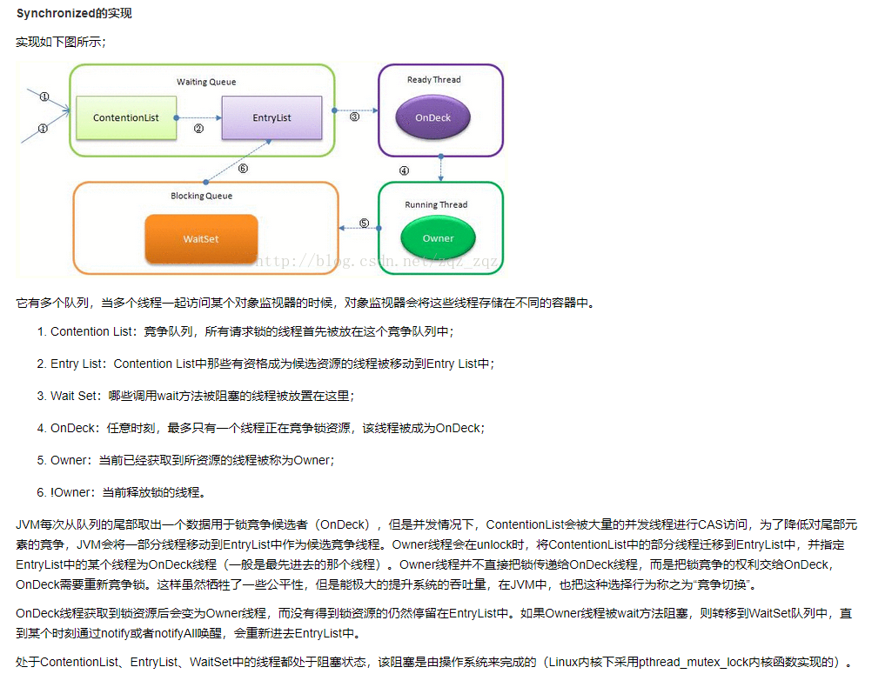
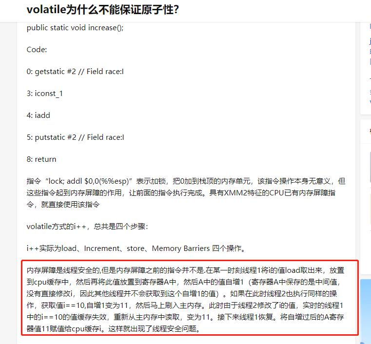

## 高并发与多线程
>主要参考 mashibing 相关课程
> 《Java并发编程的艺术》
> 《Java高并发编程详解》

---

### 进程与线程，进程、线程的概念
> 进程是指处于运行过程中的程序，并且具有一定的独立功能。进程是系统进行资源分配和调度的一个单位，当程序进入内存运行时，即为线程
>
> 线程是进程的组成部分，一个进程可以拥有多个线程，而一个线程必须拥有一个父进程，线程可以拥有自己的堆栈、程序计数器、局部变量，但不能拥有系统资源。它与父进程的其他线程共享该进程的所有资源。
>
> 参考链接：<https://www.zhihu.com/question/33515481>

- #### 线程:
  - 进程中负责程序执行的执行单元
  - 依靠程序执行的顺序控制流，只能使用程序的资源和环境，共享进程的全部资源
  - 有自己的堆栈和局部变量，没有单独的地址空间
  - CPU调度和分派的基本单位，持有程序计数器，寄存器，堆栈
  - 独立运行，当前线程不知道进程中是否还有其他线程存在
  - 执行是抢占式的，当前执行的线程随时可能被挂起，以便运行另一个线程
- #### 进程的特点:
  - **独立性**：进程是系统中独立存在的实体，可以独立拥有资源，每个进程都有自己独立的地址空间，没有进程本身的运行，用户进程不可以直接访问其他进行的地址空间。
  - **动态性**：进程和程序的区别在于 进程是动态的，进程中有时间的概念，进程具有自己的生命周期和各种不同的状态。
  - **并发性**：多个进程可以在单个处理器上并发执行，互不影响。
- #### 并发与并行的区别:
  - **并发(concurrent)**：
    - 解释1：旨在任务提交的时候，好多个任务可以同时提交，看似多个任务在同时运行
    - 解释2：有处理多个任务的能力，但不一定要同时(宏观并行，微观串行)
  - **并行(parallel)**：
    - 解释1(对应并发解释1)：旨在任务执行的时候，多个任务可以同时处理(多核CPU同时处理)，并发的子集
    - 解释2(对应并发解释2)：有同时处理多个任务的能力。(需要多核CPU)
- #### 用户线程和内核线程(待完善)
- #### Java与线程(待完善)
  
---

### java线程基础
- #### 线程的创建和启动
  - 继承Thread类，重写run方法，调用实例的start方法运行
  - 实现runnable接口，重写run方法，创建runnable实现类的实例，传递个Thread对象，调用start方法
  - 通过Executors方法采用线程池的方式创建
  - 还可以使用Callable和future创建带有返回值的线程
- #### 线程优先级
  - 线程优先级决定线程需要多或者少分配一些处理器资源的线程属性。Java线程通过priority整型变量控制优先级，通过setPriority()方法修改，默认优先级为 **5**，优先级高的线程分配时间片的数量要多于优先级低的线程。但需要注意的是，**系统环境有很大的概率会忽略线程优先级的设置**。
- #### 线程的状态
> 线程状态的转换图 
> 同步队列、等待队列的讲解可参考<https://blog.csdn.net/pange1991/article/details/53860651>
>

  - new：初始状态，线程被调用，但还没有调用start()方法
  - runnable：运行状态，将操作系统的就绪状态和运行状态，笼统地称作 运行中 
    - ready：就绪状态，在cpu的等待队列，有资格运行，但调度程序没有选到你
    - running： 获取到cpu时间片，开始执行线程里的方法
  - waiting：等待状态，线程进入等待状态，需要等待其他线程通知或中断
  - timed_waiting：超时等待状态，该状态不同于waiting，可以在指定的时间自行返回
  - block：阻塞，没有拿到锁
  - terminated：终止状态，表示当前线程已经执行完毕 
- #### 线程的方法
  - sleep方法: 让当前线程阻塞一段时间，如果在同步方法中调用不会释放对象的锁，时间到了之后会主动退出阻塞，可中断方法，被中断后收到中断异常。为Thread类特有的方法
  - wait/notify/notifyall方法：Object类的方法，所以必须在同步方法中调用。wait方法会释放对象的锁，其他的线程也可以抢占该资源。对象调用wait方法会加入等待队列，需要调用对应的notify/notifyall方法重新将线程加入同步队列中(同步队列中的线程为准备竞争锁的线程)
  - join方法：t1,t2线程启动后，分表调用t1.join，t2.join，可以保证t1先让出时间片，等待t2执行完之后，在继续执行
  - yeild方法：提醒调度器当前线程愿意放弃当前的CPU资源，若cpu资源不紧张，则忽略这个提示。不常用。
- #### interrupt
  - 中断的概念：当线程调用阻塞方法进入阻塞状态时，存在一直阻塞、无法释放锁或死锁的情况。调用对应线程的interrupt方法，会打断这种阻塞，并抛出InterruptedException异常。
  - 实现：每个线程内部存在着名为 interrupt flag得标识，如果线程被interrupt，其flag将被设置。**对于非阻塞中的线程, 只是改变了中断状态, 即Thread.isInterrupted()将返回true; 对于可取消的阻塞状态中的线程, 比如等待在这些函数上的线程, Thread.sleep(), Object.wait(), Thread.join(), 这个线程收到中断信号后, 会抛出InterruptedException, 同时会把中断状态置回为true.但调用Thread.interrupted()会对中断状态进行复位。但实践发现，对于可中断方法**
  - **注意**：设置interrupt只是将该标志位重置，但并不会让线程中断。**在Core Java中有这样一句话：”没有任何语言方面的需求要求一个被中断的程序应该终止。中断一个线程只是为了引起该线程的注意，被中断线程可以决定如何应对中断 “**   如果想让一个线程中断之后停止，需要使用辅助变量进行停止。
  jvm不推荐停止一个线程，如果想停止一个线程，可以使用interrupt方法，进行中断，对应的线程会抛出中断异常，解开对应线程的阻塞。  

---

### JMM内存管理
- #### Java内存模型
  - 主要解决得问题是 线程之间的通信问题和线程之间的同步问题。
  - Java的并发采用共享内存模型，Java线程之间的通信总是隐式进行，整个通信过程完全透明。
  - 结构:
    - 主内存(Main Memory)：线程之间的共享变量存储在主内存。
    - 本地内存(Local Memory)：每个线程都有一个私有的本地内存，存储了该线程以读/写共享变量的副本。本地内存是JMM的一个抽象概念，并不真实存在，涵盖了缓存，写缓冲区，寄存器及其他的硬件和编译器优化。
  - 线程A和线程B通信的过程:
    - 线程A把本地内存A中更新过的变量刷新到主内存中。
    - 线程B到主内存中去读取线程A之前更新过的共享变量。
- #### 重排序
  - 从java源代码到最终实际执行的指令序列，会经历下面三种重排序:
    - 编译器优化重排序：编译器在不改变单线程程序语义的前提下，重新安排语句的执行顺序。JMM的编译器重排序规则会禁止特定类型的编译器重排序。
    - 指令级并行重排序：属于处理器重排序。对于处理器重排序，JMM的处理器重排序规则会要求Java编译器在生成指令序列时，插入特定类型的内存屏障。
    - 内存系统重排序：属于处理器重排序
  - JMM属于语言级的内存模型，确保在不同的编译器和不同的处理器平台之上，通过禁止特定类型的编译器重排序和处理器重排序，为开发人员提供一致的内存可见性保证。JMM把内存屏障指令分为4类:
    - LoadLoad Barriers
    - StoreStore Barriers
    - LoadStore Barriers
    - StoreLoad Barriers Store1:StoreLoad:Load2 确保Store1数据对其他处理器变得可见
  - 编译器不会对存在数据依赖性关系的两个操作进行重排序，包括 写后读，写后写，读后写。
- #### happens-before原则
  - 概念：如果一个操作执行的结果，需要对另一个操作可见，那么这两个操作之间必须要存在happens-before关系。这里的两个操作既可以是在一个线程之内，也可以在不同线程之间。
  - 和程序员密切相关的happens-before规则：
    - 程序顺序规则: 一个线程中的操作，happens-before于该线程中的任意后续操作。
    - 监视器锁规则: 对一个锁的解锁，happens-before于随后对这个锁的加锁。
    - volatile变量规则: 对一个volatile域的写，happens-before于任意后续对这个volatile域的读。
    - 传递性: 如果A happens-before B，且 B happens-before C , 那么 A happens-before C。

---

### synchronized和volatile

- #### synchronized简介
> 参考链接：https://blog.csdn.net/tongdanping/article/details/79647337
> https://crossoverjie.top/2018/01/14/Synchronize/

  - Synchronized是一个同步关键字，多线程场景下，如果不进行同步可能会导致数据不安全，Synchronized关键字就是用于代码同步。数据不安全要满足两个条件: 数据共享(临界资源);多线程同时访问并改变该共享数据。
  - Synchronized锁的使用场景:
    - 修饰普通同步方法：锁对象 是 当前实例对象
    - 修饰静态同步方法：锁对象 是 当前的类Class对象
    - 修饰同步代码块：锁对象是Synchronized后面括号里配置的对象。该对象可以是某个对象，也可以是某个类。
  - 注意：
    - 使用synchronized修饰类和对象时，由于类对象和实例对象分别拥有自己的监视器锁，因此不会阻塞 (相当于不同对象都持有各自的锁)
    - 使用synchronized修饰非静态方法或者使用synchronized修饰代码块时指定的为实例对象时，同一个类的不同对象拥有自己的锁，因此不会相互阻塞
    - 线程A访问实例对象的非static synchronized方法时，线程B也可以同时访问实例对象的static synchronized方法，因为前者获取的是实例对象的监视器锁，后者获取的是类对象的监视器锁，两者不互斥
    - 使用synchronized修饰实例对象时，如果一个线程正在访问实例对象的一个synchronized方法时，其他线程不仅不能访问该synchronized方法，该对象的其他synchronized方法也不能访问，因为一个对象只有一个监视器锁对象，但其他线程可以访问该对象的非synchronized方法。
  - #### Synchronized实现原理
    - 对象的内存布局
      - 对象头：
        - **Mark Word**：存储对象的hashCode、GC分代年龄、锁状态标志、线程所持有的锁、偏向线程ID、偏向时间戳等
        - **类型指针**：对象指向它的类元数据的指针。来确定这个对象是哪个类的实例。
        - **数组length**：如果对象是数组，还需要保存数组的length数据
        - 32位虚拟机中对象markword的详细信息
        - 64位虚拟机中对象markword的详细信息
        
      - 实例数据：对象真正存储的有效信息，既程序代码中所定义的各种类型的字段内容。
      - 对齐填充：占位符作用，不是必然存在。使整个对象满足8子节的整数倍。
    - synchronized在jvm中的实现原理 
      - 重量级锁对应的锁标志位是10，存储了指向重量级监视器锁的指针，在Hotspot中，对象的监视器（monitor）锁对象由ObjectMonitor对象实现（C++）
      - 下图是多线程下进入synchronized的流程
    - synchronized在jvm层的实现
      - synchronized在JVM规范中，都是基于进入和退出monitor对象来实现的，但具体的实现也有不同，主要区分在修饰同步方法和修饰代码块
      - 修饰代码块: 修饰代码块主要是在反编译后，进入代码块前加monitorenter(进入代码块)，代码块结束加monitorexit(退出代码块)。为了报证不论是正常结束还是抛出异常结束，一般会出现两次的monitorexit语句
      - 修饰同步方法:修饰同步方法是由方法调用指令来读取运行时常量池中的ACC_SYNCHRONIZED标志隐式实现的。如果方法表结构（method_info Structure）中的ACC_SYNCHRONIZED标志被设置，那么线程在执行方法前会先去获取对象的monitor对象，如果获取成功则执行方法代码，执行完毕后释放monitor对象，如果monitor对象已经被其它线程获取，那么当前线程被阻塞。( ACC_SYNCHRONIZED 在 编译后的 flags 标志位中)
  - #### 锁的升级
    - synchronized本身是重量级锁，对性能不是很友好。从1.6 开始，主键加入 自旋锁、偏向锁、轻量级锁、最后在升级到重量级锁。锁只能升级，不能降级，一旦升级到重量级锁，之后也只能是重量级锁。
    - 锁的升级过程、偏向锁、自旋锁的概念参照 JVM思维导图
  
  - #### volatile简介
  > 可参考 https://www.cnblogs.com/noteless/p/10401193.html
  > 
  - volatile 是一个轻量级的同步机制，可以报证 可见性 和 有序性。但不能报证原子性。下面对三个性质进行简要概述
    - 原子性：原子性即为一个整体，要么都执行，要么都不执行。实现原子性两种方式：synchronized锁，cas操作。
    - 可见性：如果一个线程对某个共享变量进行更新之后，后续访问该变量的线程可以读取到该更新的结果，那么就称这个线程对该共享变量的更新对其他线程可见，否则就称这个线程对该共享变量的更新对其他线程不可见。(可见性的结果是当前可见性。即 如果已经读取过主内存值的线程，当其他线程进行写主内存操作之后，不会再刷新新值,参照 https://www.zhihu.com/question/329746124 知乎的回答 Kosho 的回答，不太理解。但 千帆 的回答貌似解释了这一问题，)
    - 有序性：将貌似串行语句as-if-serials扩展到多线程中，保证多线程环境下，程序的执行顺序。
  - volatile 底层语义的实现是通过 汇编代码中的 lock 指令来做的。具体参考 https://www.cnblogs.com/xrq730/p/7048693.html

---

### cas的实现类及面试题(生产者和消费者，交替打印)
- #### CAS简介
  - cas的思想：三个参数，一个当前内存值V、旧的预期值A、即将更新的值B，当且仅当预期值A和内存值V相同时，将内存值修改为B，并返回true，否则什么都不做，并返回false。
  - cas的实现：主要使用的是Unsafe类的compareAndSwapInt 方法的各种演变。该类可以提供硬件级别的原子操作，可以获得某个属性在内存中的位置，也可以修改对象的字段值。该类底层使用C++编写，java中都是使用native修饰。
  - **cas的常见问题**:
    - **ABA问题**：cas的流程大致为: 1）首先从地址 V 读取值 A；2）根据 A 计算目标值 B；3）通过 CAS 以原子的方式将地址 V 中的值从 A 修改为 B。 在 过程3之前，有可能另一个线程已经更改过V的值，并最终有更改回了A，这样当前线程就会认为没有线程更改过，但事实上已经有线程更改了，出现ABA问题。可以使用AtomicStampedReference来解决，加上版本号。
    - **循环时间长开销很大**：例如getAndAddInt方法，如果CAS失败，会一直进行尝试，如果CAS一直不成功，会对CPU造成很大的开销。
    - **只能保证一个共享变量的原子操作**：CAS操作只能保证一个共享变量的原子操作，当有多个共享变量的时候，则无法保证。可以使用锁保证多个共享变量的原子操作。
- #### CAS的常见应用类
  - LongAdder：cas操作，使用方法类似于AtomicInteger。使用的是分段锁，把值放到数组中，分段进行操作，最后将结果累加。
  - AtomicInteger：多线程下Integer的自增方法，可以实现原子性的 i++类操作。AtomicInteger.incrementAndGet()方法
  - ReentrantLock：可重入锁。并发锁的一种实现，可替代synchronized在高并发程序种使用。
  - cyclicbarrier：可以实现一组线程互相等待，当所有线程到达某个屏障点再进行后续的操作。基于ReentrantLock和Condition实现。

---

### AQS实现原理，源码简析

---

### ThreadLocal原理及简要分析

---

### 容器与并发容器

---

### 线程池ThreadPoolExecutor 及ForkJoinPool及Executors

