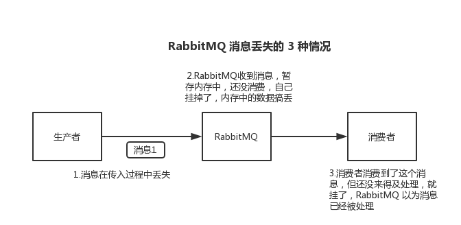

## 消息队列相关知识及面试点
---
> 参考资料 
> https://doocs.github.io/advanced-java/#/
> https://juejin.cn/post/6844903766743842823

---

### 消息队列的常见使用场景
- 期待的回答: 哪个业务场景下，有什么技术挑战，不用MQ会比较麻烦，使用MQ之后带来很多好处
- 常见 的使用场景:
  - 解耦:
  - 异步:
  - 削峰:

---

### 常见消息队列的选型、对比

|特性 | ActiveMQ | RabbitMQ | RocketMQ | Kafka|
|:---|:--------|:------|:-------|:-----|
|单机吞吐量| 万级，比RocketMQ、Kafka低一个数量级 | 同ActiveMQ | 10万级，支持高吞吐量 | 10万级，高吞吐，配合大数据类的系统进行实时数据计算、日志采集等场景 |
|topic数量对吞吐量的影响| | | topic可以到百/千的级别，吞吐量会有较小服务的下降，RocketMQ的优势，同等机器下，可支撑大量的topic | topic从几十到击败的时候，吞吐量会大幅下降，同等机器侠，kafka尽量报证topic数量不要过多 |
|时效性| ms级 | 微秒级，延迟最低 | ms级 | ms级以内 |
|可用性| 高，基于主从架构，实现高可用 | 同Active MQ | 非常高，分布式架构 | 非常高，分布式，一个数据多个副本，少数机器宕机，不会丢失数据，不会导致不可用 |
|消息可靠性| 有较低的概率丢失数据 | 基本不丢 | 经过参数优化配置，可以做到0丢失 | 同RocketMQ |
|功能支持| MQ领域的功能极其完备 | 基于erlang开发，并发能立很强，性能极好，延时很低 | MQ功能较为完善，分布式，扩展性好 | 功能较为简单，主要支持简单的MQ功能，在大数据领域的实时计算及日志采集被大规模使用 |

---

### 消息队列的高可用

>  高可用类的问题，需要针对不同的消息队列进行不同的回答，不同的消息队列采用不同的架构方案实现高可用，以下是 RabbitMQ 和 Kafka 的高可用架构简述
>

---

-  **RabbitMQ 的高可用**

 > RabbitMQ是基于主从(非分布式)架构做高可用的，有三种模式：单机、普通集群、镜像集群
 >

  - 单机模式：一般本地使用
  - 普通集群模式：(无高可用)
    - 在多台机器上启动多个RabbitMQ实例，每台集器启动一个。创建的queue，只会放在一个RabbitMQ实例上，但是每个实例都同步queue的元数据(queue的配置信息，通过元信息，找到queue所在实例)。当消费的时候，如果连接到了另外一个实例，则从queue所在的实例上拉取数据过来。
    - 该方案主要目的在于提高吞吐量，让集群中多个节点来服务某个queue的读写操作。但该方案很麻烦，也没做到所谓的分布式。拉取数据的时候会导致要么随机连接一个实例再拉取数据(存在数据拉取的开销)，要么固定连接queue所在的实例的数据(单实例性能瓶颈)。
  - 镜像集群模式：(高可用)
    - 镜像集群模式下，创建的queue，无论元数据还是queue里的消息都会存在多个实例上，每个RabbitMQ节点都有这个queue的完整镜像，包含queue的全部数据，每次向queue中写数据的时候，会自动将消息同步到多个实例的queue上。
    
    - 通过RabbitMQ的管理控制台，可以新增相关的镜像集群模式策略，开启镜像集群模式。可以指定同步数据到所有节点还是只同步到指定数量的节点。

    - 该模式的好处是任何一个机器宕机了，都有其他的节点可以使用。坏处是:1.性能开销大(数据同步多分，网络带宽压力大)；2.扩展性低(机器上包含queue的所有数据，可能无法承载这些数据)
    
      
    
- **Kafka 的高可用 **
> kafka基本架构: 由多个broker组成，每个broker是一个节点；topic可划分为多个partition，每个partition可以存在于不同的broker上，每个paritition就放一部分数据。0.8之后，每个partition的数据会同步到其他机器上，形成自己的多个replica副本。提供HA机制。
> 

- 生产者发送的消息会被分为设置的partition个数量，发送到不同集器，同时每个partition的数据都会同步到其他机器上，形成自己的多个replica副本，所有replica会选举一个leader出来，那么生产和消费都跟这个leader打交道，然后其他replica就是follower。写的时候，leader会负责把数据同步到所有follower上去，读的时候就直接读leader上的数据即可。如果可以随意读写多个follower，那么就需要考虑数据一致性的问题了，复杂度太高。
- 写数据时，生产者写leader，leader将数据落地写本地磁盘，接着其他follower自己主动从leader pull数据。一旦所有follower同步好数据，发送ack给leader,leader收到所有follower的ack之后，返回成功给生产者
- 消费时，只从leader去读，但只有一个消息已经被所有follower都同步成功返回ack的时候，消息才会被消费者看到 

---

### 消息队列的可靠性传输
> 可靠性传输主要指 如何确保消息不被丢失。要保证消息在传输的过程中，不多也不少。不多可以参考下述的重复消费问题，该处讨论如何处理消息不会丢失问题。
> 

- RabbitMQ处理方案
  > 消息丢失主要出现在以下三种情况 
  
  - 生产者丢失数据
  
    两种方案:
  
    - 开启RabbitMQ提供的事务功能，生产数据前开启事务 channel.txSelect，RabbitMQ接收异常回滚事务channel.txRollback，收到消息，提交事务channel.txCommit。事务是采用同步的方式，提交事务会将程序阻塞，影响吞吐量
    - 开启confirm模式。生产者开启confirm模式之后，每次写的消息都会分配一个唯一ID，如果写入到了RabbitMQ中，会回传一个ack消息，如果RabbitMQ没能处理，会回调一个nack接口，告诉你消息接受失败，可以重试。confirm模式是异步的，推荐使用confirm模式。
  
  - RabbitMQ丢失数据
  
    RabbitMQ自己弄丢数据，这个需要开启RabbitMQ持久化来保证，将消息持久化到磁盘，即时RabbitMQ挂了，恢复之后还可以自动读取之前的数据。配置持久化需要两个步骤:
  
    - 创建queue的时候，将其设置为持久化。该操作可以报证RabbitMQ持久化queue的元数据，但不会持久化queue里的数据。
    - 发送消息的时候将消息的deliveryMode设置为2。该配置是将消息设置为持久化。
    
    通过上述两个步骤，在加上生产数据的时候使用confirm模式，基本上可以报证在生产者和rabbitmq内部可以保证消息不会丢失。
  
  - 消费端丢失数据
  
    消费端处理丢失数据，可以关闭RabbitMQ的自动提交ack机制，改成手动提交，这样只有消息处理完成才提交ack，告诉RabbitMQ消息处理成功
  
    

- Kakfa处理方案
  > kafka 的处理方案在结构上和rabbitmq类似，也是从三个部分出发，生产者端、kafka内部、消费者端

  - 消费者端丢失数据
  
    消费者端丢失数据，可以关闭自动提交offset，选择自己提交offset，只有对应消息处理成功之后，才发送offet。
    
  - kafka丢失数据
    
    > kafka丢失数据的场景一般为kafka某个broker宕机的时候，需要重新选leader，但正好把数据没有同步的follower选举为leader，导致数据丢失。

    针对该场景，要求kafka配置以下4个参数

      - topic设置 replication.factor，该值必须大于1，要求每个partition必须有至少2个副本
      - Kafka服务端设置 min.insync.replicas参数，该值必须大于1，要求一个leader至少感知到有至少一个follower还跟自己保持联系。
      - producer端设置acks=all，要求每条数据，必须写入所有replica之后，才能认为写入成功
      - producer端设置retries=MAX，一旦雪茹失败，就无限重试。

    以上四个参数至少可以报证在leader所在broker发生故障，进行leader切换时，数据不会丢失

  - 生产者端
    生产者端 设置 acks=all，一定不会丢。报证leader接收到消息后，所有follower都同步到消息之后之后才认为本次写入成功。

---

### 消息不被重复消费

- 不被重复消费的最终结论是报证消息的幂等性，所以就算是消息重复消费了只要保证消费的幂等性就可以(但能在生产者端先做到发送消息不重复最好)。幂等性，通俗来说，就是一个数据或者一个请求，重复来多少次，确保对应的结果数据不会改变。
- 报证幂等性的方案:
  - 数据库的唯一约束实现: 根据业务唯一编号，设置表中的唯一索引，根据唯一索引进行幂等性判断
  - 根据redis的原子性：根据redis的原子性特性，每次获取到消息都通过set方式存入redis。redis的数据是否落库也是问题。(考虑数据库和缓存数据的同步，可以使用databus类的中间件)
  - 唯一ID+指纹码机制(也是利用数据库的唯一性约束)；高并发时 可以根据ID进行分库分表的操作

---

### 消息的顺序性

---

### 消息的延时及过期失效问题

---

### 如何设计一个消息队列

---

### 如何处理消息队列中的消息堆积

