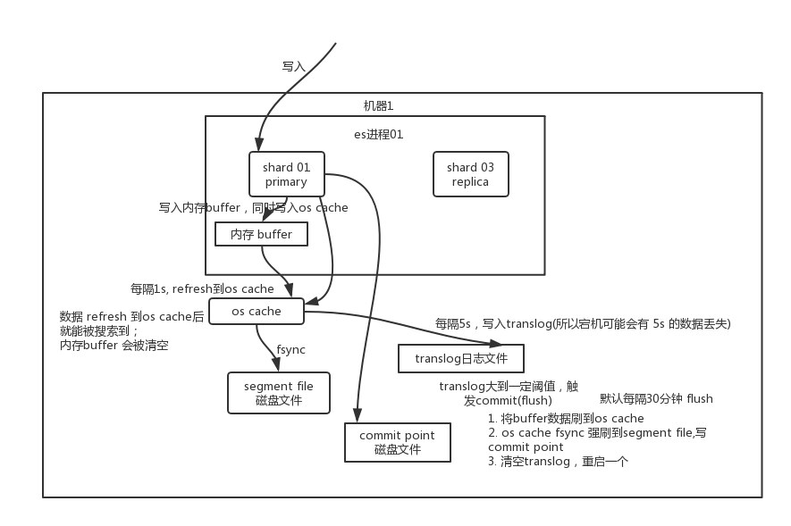

## ElasticSearch相关文档
> 相关参考链接 
> https://doocs.github.io/advanced-java/#/./docs/high-concurrency/es-optimizing-query-performance
> 《Elasticsearch技术解析与实战》
> https://www.elastic.co/guide/cn/elasticsearch/guide/current/_online_resources.html 官方指南
> https://www.cnblogs.com/wcgstudy/p/11449000.html
> https://www.6aiq.com/article/1552148885834 es相关性计算原理
> https://cloud.tencent.com/developer/article/1420702
> https://www.cnblogs.com/liuxinyustu/articles/13557694.html
>
> https://www.cnblogs.com/surasun/articles/10752021.html
>
> https://blog.csdn.net/jiaojiao521765146514/article/details/83753215 es写入数据的原理

---

#### 大数据量下的es查询优化

> es 在使用的过程中，默认会进行一些相关的设置，可以支持普通的查询。但当数据量变大，数据量可能达到数十亿级别的时候，查询的效率就可能变的很低(5-10s)，这时候就需要一些调优的方案进行处理

  - filesystem cache
    向es写入的数据，实际上都存入了配置好的磁盘中，但查询的时候，操作系统会将磁盘文件自动缓存到filesystem cache里。  es搜索引擎严重依赖于底层的filesystem cache,如果给其足够多的内存，能容纳下所有的索引数据文件，那么搜索的时候就基本都是走内存的，性能也会很高。
    在最佳的情况下，机器的内存至少容纳总数量的一半，性能会相对更好一些。
    在存储es数据的时候，也可以将搜索的字段存入es中，将该条数据不搜索的数据存入到hbase中。这样，让数据尽可能的都存入到内存中，查询的时候直接走内存，在通过id，将其他数据从hbase中取出。

  - 数据预热
    如果按照上面的方案，依然filesystem不够用，那么可以采用数据预热的方式。可以设置一个专门的缓存预热子系统，将一些数据提前或定时的预热到filesystem cache中，这样查询热点数据的时候就是查询的缓存了，效率提升。

  - 冷热分离
    对于查询频率低的数据，可以设置到不同的index中，这样，查询频率高的数据占用的内存空间小，更能存入到filesysetemcache中，提高查询效率

  - document模型设计
    尽量在存数据的时候就已经将数据整理好，关联数据也存储好。在查询es的时候，避免复杂的关联查询。

  - 分页相关
    es得数据是分布式的存储在各个分片上的，当在页面上要查询第一百页的数据(每页10条)，需要把每个shard上存储的前1000条数据都查到一个协调节点上，接着协调节点对这些数据进行合并、处理，在获取最终的第100页的10条数据。  这种方式导致，如果查找更深页的数据的时候，需要将大量数据加载到协调节点，这样会比正常查询更耗时。
    针对es这种设计，es给了两种平滑的查询方式，scroll api 和search_after。
      - scroll api 会一次性的生成所有数据的一个快照，每次滑动向后翻页就是通过游标scroll_id移动，获取下一页下一页，性能比普通分页查询高很多，基本是毫秒级。
      - search_after 使用前一夜的结果来帮助检索下一页的数据，初始化的时候，需要使用一个唯一值的字段作为sort字段。

---

####　常用的优化方式
- 使用批量请求提交数据。提交数据的时候现在单个分片的单个节点上进行基准测试，保证单节点的性能最佳。
- 使用多worker/线程方式向es发送数据，单个线程不太可能最大化的利用elasticsearch集群，使用多线程发送数据，最大化利用集群性能。
- 调大refresh interval。默认的index.refresh_interval是1s，迫使Elasticsearch每秒创建一个新的分段。增加这个值可以提高索引的速度。
- 加载大量数据时禁用refresh和replicas。避免refresh和replicas虽然会暂时让索引处于危险之中，但可以快速的存储数据。加载完成后将这两个值设置位原值。
- 设置参数，禁止OS将es进行swap进去
- 为filesystem cache分配一半的物理内存
- 使用自动生成id。使用自动生成的id可以避免查询相同的文档是否在一个shard中，索引的容量越多，花费的成本越高。
- 使用更好 的硬件。搜索一般是io密集型的，需要 a.为filesystemcache分配更多的内存，b.使用ssd硬盘 c. 使用local storage
- 如果节点做很重的索引计算，确保 indices.memory.index_buffer_size 最多给512M的缓冲内存（更高的内存不会有更显著的提高）。
- 避免稀疏
  a. 不相关数据不要放在同一个索引
  b. 一般化结构文档
  c. 避免类型 同一个index，最好就一个mapping type
  d. 稀疏字段上，禁用norms(用于计算score，所有filtering字段，都可以禁用norms),doc_values(用于sort和aggregations，不使用这两个的时候，可以禁用)

---

#### ES的分布式架构原理
- 数据存储结构
> index -> type -> document -> field
>

  - index 相当于mysql里的一张表，数据都存在某个index的下方

  - type index下面可以有多个type，每个type的字段都是差不多的，但有略微的差别。

  - document 具体的一条数据的记录

  - field document中有多个field，每个field代表这个document中的一个字段的值
    

    每个索引都可以被拆分成多个shard , 每个shard存储部分数据。拆分多个shard主要有两个好处:1.支持横向扩展，三个shard的数据需要扩展为4个chard，直接将数据重新导一份就可以了；2.提高性能，数据分布在多个shard，所有的操作会在多台机器上并行分布致性，提高吞吐量和性能。
    shard还会有备份的机制，每个shard都有一个primary shard，负责写入数据，但还会有几个replica shard 。primary shard写入数据之后，会将数据同步到其他几个replica shard上。
    es集群的多个节点，会自动选举一个节点为master节点，master节点主要是干管理的工作，包括维护索引元数据、且换primary shard和replica shard身份等，要是master节点宕机，会重新选举一个节点为master节点。
- 总结
  - index包含多个shard。
  - 每个shard都是一个最小工作单元，承载部分数据，lucene实例，完整的建立索引和处理请求的能力。增减节点时，shard会自动在nodes中负载均衡。
  - primary shard和replica shard，每个document肯定只存在于某一个primary shard以及其对应的。replica shard中，不可能存在于多个primary shard。
  - replica shard是primary shard的副本，负责容错，以及承担读请求负载。副本中的数据保证强一致或最终一致。
  - primary shard的数量在创建索引的时候就固定了，因为索引时，需要按照primary shard的数量为文档做路由（默认使用文档的_id属性取哈希值做路由，也可以通过routing指定使用其他文档字段取哈希值做路由）。replica shard的数量可以随时修改。
  - primary shard的默认数量是5，replica默认是1，默认有10个shard，5个primary shard，5个replica shard。
  - primary shard不能和自己的replica shard放在同一个节点上（否则节点宕机，primary shard和副本都丢失，起不到容错的作用），但是可以和其他primary shard的replica shard放在同一个节点上。

---

#### es写数据的流程
> 
> https://www.cnblogs.com/jelly12345/p/15060133.html

- 要写入的数据首先会写入到内存buffer中，但此时是搜索不到的;-
- 如果buffer快满了，或者达到指定的时间，内存buffer数据会被refresh到一个新的segment file中，但该数据文件不是磁盘中的segment file，而是 os cache ，该过程叫 **refresh** 。数据写入到os cache之后，buffer就会被清空。
- refresh操作的前提: 如果buffer内与数据，默认每1秒钟会进行一次refresh操作。由于这一秒钟的时间耽搁，es被称为准实时的(NRT , near real-time)。也可以通过api手动调用refresh操作，让数据立即可以被看见。
- 当数据进入到os cache后，数据可以被搜索到。
- 重复上述的步骤之后，新的数据不断进入buffer和translog ，不断将buffer数据写入到一个新的segment file中，每次refresh完，buffer清空，translog保留。随着数据的增多，translog达到一定长度的时候，会触发**commit**操作。
- commit操作: 首先将buffer中现有数据refresh到os chache中，清空buffer。将一个commit point 写入磁盘，里面记录着 commit point对应的所有segment file，同时强行将os cache中目前所有的数据都 fsync 到磁盘文件中。该操作被称为 **flush**,默认30分钟自动执行一次flush，如果translog过大，也会触发flush，也可手动触发flush操作。
- translog的作用: 执行commit操作之前，数据要么停留在buffer中，要么在os cache中，无论buffer还是os cache都是内存，一旦机器宕机，数据全部丢失，所以translog日志文件的就是为了保证数据文件的恢复，但由于从内存到translog默认需要5s的时间，所以es也会出现丢失5秒内数据的情况。也可以手动设置每次写操作直接fsync到磁盘，但会影响性能。

##### 总结
数据先写入内存 buffer，然后每隔 1s，将数据 refresh 到 os cache，到了 os cache 数据就能被搜索到（所以我们才说 es 从写入到能被搜索到，中间有 1s 的延迟）。每隔 5s，将数据写入 translog 文件（这样如果机器宕机，内存数据全没，最多会有 5s 的数据丢失），translog 大到一定程度，或者默认每隔 30mins，会触发 commit 操作，将缓冲区的数据都 flush 到 segment file 磁盘文件中。

---

#### 倒排索引
> https://zhuanlan.zhihu.com/p/76485252

倒排索引的主要目的是通过某个单词，可以快速找到其对应的文档，及可能在文档中的位置(看是否需要短语定位之类的功能)。但这么多的单词每个都遍历一遍，那效果肯定也很差，所以对单词进行了类似于B+树一样的排序，可以在页里二分查找，但单词还在磁盘中，每次都IO操作，也会慢，但整体都加载到内存中内存也不一定能放下，所以，lucene的倒排索引，最左侧增加了一层 **字典树**，不存储所有的的那次，只存储单词前缀，通过字典树找到单词所在块(大致位置)，再在块里二分查找，找到对应单词，最后找到响应文档。lucene还用FST进行进一步压缩。

---

#### es 的三种查询
> https://blog.csdn.net/ChengHuanHuaning/article/details/117696054
> 

- from+size 浅分页
    - 查询前20条数据，截断前10条数据，只返回 10-20的数据。查询原理是在所有分片中取20条数据，然后取最后面的10条，当翻页量多的时候，取出的总数变多，性能就会变低
- scroll 分页
    - GET test_dev/_search?scroll=5m 表示这个scroll_id保留5分钟，使用scroll的from必须设置为0 ，size决定每次调用_search的数量
    - 通过滑动获取分页数据，不能跳页
    - scroll 非常消耗资源(可能是因为保留了一个数据快照?),官方建议不用于事实的请求，一般用作导出数据使用
- search_after
    - 无法跳页，根据上一页的最后一条数据来确定下一页的位置，可以将数据的增删改实时的反映到数据上。使用有些复杂
    

---

#### 创建分片时需要注意什么
> https://blog.csdn.net/alan_liuyue/article/details/79585345

- 不要过度的分片，分片也是需要消耗成本的，每个分片就是一个lucene的索引，会消耗相应的文件句柄、内存和cpu
- 如果分片过多，当开始竞争硬件资源的时候，性能就会降低
- 在开始阶段，一个好的方案是按照节点数量的1.5-3倍创建分片

---

#### es的数据迁移
> https://www.infoq.cn/article/x3vc92swb7aqhamxjhzy 数据迁移的方案，从一个集群平滑迁移到另一个集群
> https://juejin.cn/post/6844904004187586573 使用 Elactis dump 进行数据迁移 ，感觉是针对离线数据
> 

---

#### es和solr的区别
> 
